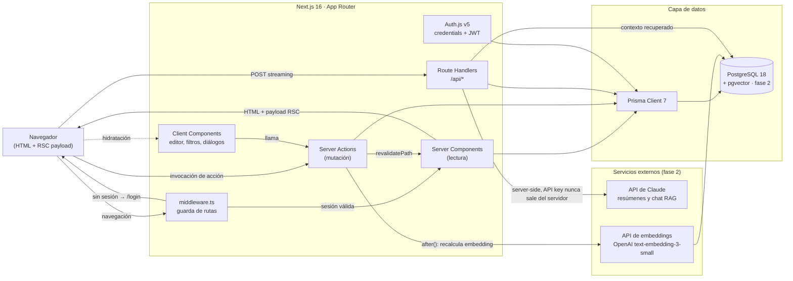
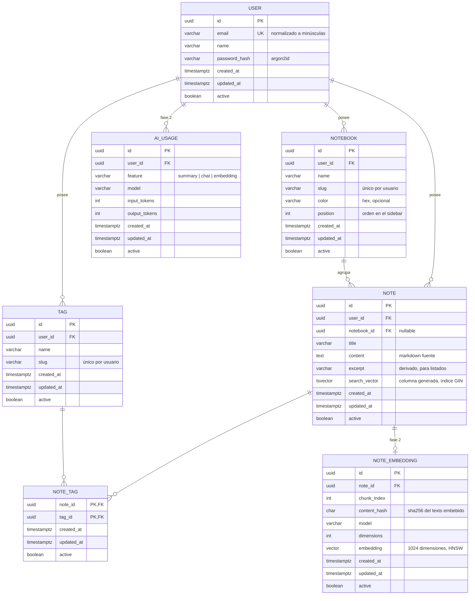

# Arquitectura — notas-app

Aplicación de notas en markdown con capacidades de IA (resumen, búsqueda
semántica y chat sobre tus propias notas). Este documento es el plano técnico
del proyecto: define el stack, la estructura, el modelo de datos y el contrato
entre capas. Todo lo que está aquí es vinculante para la implementación.

---

## 1. Visión y alcance

La aplicación resuelve un problema concreto: tomar notas en markdown y
**volver a encontrarlas**. El MVP entrega la base sólida (autenticación, CRUD,
organización, búsqueda literal) y la fase 2 añade el diferencial: entender el
contenido de las notas, no solo indexar sus palabras.

### Fase 1 — MVP

| Capacidad | Detalle                                                             |
| --------- | ------------------------------------------------------------------- |
| Cuentas   | Registro y login con email y contraseña, sesión persistente         |
| Notas     | CRUD completo, editor markdown con vista previa en vivo             |
| Cuadernos | Agrupación de notas en cuadernos de **un solo nivel**               |
| Etiquetas | Clasificación transversal, varias etiquetas por nota                |
| Búsqueda  | Full-text sobre título y contenido, filtros por cuaderno y etiqueta |
| Papelera  | Borrado lógico con restauración y purga manual                      |

### Fase 2 — IA

Se construye **sobre el MVP funcionando**, sin reescribir nada. Toda la
integración con modelos ocurre del lado del servidor.

| Capacidad              | Detalle                                                                   |
| ---------------------- | ------------------------------------------------------------------------- |
| Búsqueda semántica     | Recuperación por significado con pgvector y embeddings                    |
| Resumen automático     | Resumen de una nota larga bajo demanda, con streaming                     |
| Pregúntale a tus notas | Chat RAG: recupera las notas relevantes del usuario y responde citándolas |
| Control de costos      | Límite de uso por usuario y registro de consumo                           |

### Fuera de alcance

Colaboración multiusuario sobre una misma nota, historial de versiones,
adjuntos binarios, cuadernos anidados, aplicación móvil nativa, OAuth de
terceros. Ninguna de estas quedó bloqueada por el diseño, pero ninguna se
implementa.

---

## 2. Stack y versiones exactas

Versiones fijas (sin rangos) verificadas contra el registro. El proyecto usa
**pnpm** como gestor de paquetes.

### Entorno

| Componente | Versión                              |
| ---------- | ------------------------------------ |
| Node.js    | 24.13.0 (LTS)                        |
| pnpm       | 11.1.2                               |
| PostgreSQL | 18 (imagen `pgvector/pgvector:pg18`) |

Se usa la imagen con **pgvector desde el día uno** aunque la extensión no se
active hasta la fase 2: evita cambiar la imagen a mitad del proyecto.

### Dependencias de producción

| Paquete              | Versión       | Rol                                                 |
| -------------------- | ------------- | --------------------------------------------------- |
| `next`               | 16.2.11       | Framework fullstack, App Router                     |
| `react`              | 19.2.8        | Librería de UI                                      |
| `react-dom`          | 19.2.8        | Renderizador DOM                                    |
| `next-auth`          | 5.0.0-beta.32 | Auth.js v5, autenticación                           |
| `@prisma/client`     | 7.9.0         | Cliente de base de datos                            |
| `@prisma/adapter-pg` | 7.9.0         | Driver adapter de Prisma sobre `pg`                 |
| `pg`                 | 8.22.0        | Driver PostgreSQL                                   |
| `zod`                | 4.4.3         | Validación de entrada y de variables de entorno     |
| `@node-rs/argon2`    | 2.0.2         | Hash de contraseñas (argon2id)                      |
| `react-markdown`     | 10.1.0        | Render de markdown a React                          |
| `remark-gfm`         | 4.0.1         | GitHub Flavored Markdown (tablas, listas de tareas) |
| `rehype-sanitize`    | 6.0.0         | Saneamiento del HTML generado                       |
| `clsx`               | 2.1.1         | Composición de clases                               |
| `tailwind-merge`     | 3.6.0         | Resolución de conflictos entre utilidades Tailwind  |
| `lucide-react`       | 1.25.0        | Iconografía                                         |

### Dependencias de desarrollo

| Paquete                       | Versión | Rol                                |
| ----------------------------- | ------- | ---------------------------------- |
| `typescript`                  | 6.0.3   | Compilador (modo estricto)         |
| `prisma`                      | 7.9.0   | CLI y migraciones                  |
| `tailwindcss`                 | 4.3.3   | Estilos                            |
| `@tailwindcss/postcss`        | 4.3.3   | Plugin PostCSS de Tailwind 4       |
| `eslint`                      | 10.7.0  | Linter                             |
| `eslint-config-next`          | 16.2.11 | Reglas de Next.js                  |
| `typescript-eslint`           | 8.65.0  | Reglas de TypeScript               |
| `prettier`                    | 3.9.6   | Formateo                           |
| `prettier-plugin-tailwindcss` | 0.8.1   | Orden de clases de Tailwind        |
| `vitest`                      | 4.1.10  | Test runner unitario               |
| `@vitest/coverage-v8`         | 4.1.10  | Cobertura                          |
| `vite`                        | 8.1.5   | Requerido por Vitest               |
| `@vitejs/plugin-react`        | 6.0.3   | JSX en los tests                   |
| `vite-tsconfig-paths`         | 6.1.1   | Resolución de alias `@/*` en tests |
| `jsdom`                       | 29.1.1  | Entorno DOM para Vitest            |
| `@testing-library/react`      | 16.3.2  | Tests de componentes               |
| `@testing-library/dom`        | 10.4.1  | Peer de Testing Library            |
| `@testing-library/jest-dom`   | 7.0.0   | Matchers de DOM                    |
| `@testing-library/user-event` | 14.6.1  | Simulación de interacción          |
| `@playwright/test`            | 1.61.1  | Tests E2E                          |
| `@types/node`                 | 26.1.1  | Tipos de Node                      |
| `@types/react`                | 19.2.17 | Tipos de React                     |
| `@types/react-dom`            | 19.2.3  | Tipos de React DOM                 |
| `@types/pg`                   | 8.20.0  | Tipos del driver PostgreSQL        |

### Dependencias de la fase 2

Se instalan cuando empieza la fase 2, no antes.

| Paquete             | Versión | Rol                                         |
| ------------------- | ------- | ------------------------------------------- |
| `@anthropic-ai/sdk` | 0.112.5 | SDK oficial de Anthropic (resúmenes y chat) |
| `pgvector`          | 0.3.0   | Serialización de vectores hacia PostgreSQL  |

### Notas sobre versiones

- **TypeScript 6.0.3, no 7.0.2.** La 7.0.2 es la última estable publicada,
  pero `typescript-eslint@8.65.0` declara `typescript >=4.8.4 <6.1.0`. Fijar la
  7 rompería el linter, que forma parte del pipeline de CI. Se sube a la 7
  cuando typescript-eslint amplíe el rango.
- **Auth.js v5 en beta.** La `latest` de `next-auth` es la 4.24.15, diseñada
  para el Pages Router. La v5 (`5.0.0-beta.32`) es la única línea pensada para
  App Router y Server Components, declara compatibilidad explícita con Next 16
  y React 19, y es la que documenta el proyecto oficial. Se fija la versión
  exacta para que la beta no se mueva bajo los pies.
- **Tailwind 4 no lleva `tailwind.config.js`.** La configuración es CSS-first:
  el tema vive en `src/app/globals.css` con `@import "tailwindcss"` y
  `@theme`. Es una diferencia relevante para quien defina el sistema visual.
- **Prisma 7** usa el generador `prisma-client` (salida ESM explícita) y
  driver adapters. El cliente se genera en `src/generated/prisma` y ese
  directorio se ignora en git.

---

## 3. Estrategia de renderizado y distribución

**Aplicación híbrida con SSR dinámico dominante. No es una SPA. No es una PWA.**

| Zona                           | Estrategia                                           | Motivo                                                                             |
| ------------------------------ | ---------------------------------------------------- | ---------------------------------------------------------------------------------- |
| `/` (landing)                  | Estática (prerenderizada en build)                   | Contenido fijo, sin datos de usuario                                               |
| `(auth)` — login, registro     | Estática, con formularios que invocan server actions | El HTML no depende de datos; el POST sí                                            |
| `(app)` — todo el área privada | SSR dinámico por request                             | Cada respuesta depende de la sesión; `auth()` lee cookies y fuerza render dinámico |
| `/api/ai/*` (fase 2)           | Route handlers con respuesta en streaming            | Se necesita `ReadableStream`, no cabe en una server action                         |

Justificación:

- **No SPA.** La navegación entre notas es multi-documento manejada por el
  App Router: cada ruta trae su propio payload RSC. Esto elimina la capa de
  estado global de cliente, el fetching manual y las cachés paralelas; el
  servidor es la única fuente de verdad. El resultado sigue sintiéndose fluido
  gracias a la navegación cliente de Next y a los `loading.tsx`.
- **No SSG para el área privada.** El contenido es privado y cambia con cada
  edición; prerenderizar no aporta nada y complicaría la invalidación.
- **No PWA.** Un modo offline real exigiría persistencia local, cola de
  mutaciones y resolución de conflictos de edición: es un subproyecto entero
  y aporta poco a un gestor de notas que se usa en escritorio con conexión. Se
  descarta explícitamente para que nadie asuma que existe un service worker.
  La app sí es plenamente responsive y usable en móvil vía navegador.
- **Server Components por defecto.** Los client components se declaran caso a
  caso y se justifican en la sección 8.

---

## 4. Diagrama del sistema



---

## 5. Estructura de carpetas

```
notas-app/
├── prisma/
│   ├── schema.prisma            # fuente única del esquema
│   ├── migrations/              # migraciones versionadas, incluidas las editadas a mano
│   └── seed.ts                  # datos de demostración para desarrollo
│
├── public/                      # activos estáticos servidos tal cual
│
├── e2e/                         # tests Playwright (fuera de src: no se compilan con la app)
│   ├── fixtures/                # usuarios y datos sembrados por escenario
│   └── *.spec.ts
│
├── src/
│   ├── app/                     # App Router: solo enrutado y composición
│   │   ├── layout.tsx           # layout raíz: html, fuentes, providers globales
│   │   ├── page.tsx             # landing pública (estática)
│   │   ├── globals.css          # Tailwind 4: @import y @theme
│   │   ├── not-found.tsx
│   │   ├── error.tsx
│   │   │
│   │   ├── (auth)/              # grupo sin sesión; layout centrado y minimalista
│   │   │   ├── layout.tsx
│   │   │   ├── login/page.tsx
│   │   │   └── register/page.tsx
│   │   │
│   │   ├── (app)/               # grupo autenticado; layout con sidebar y cabecera
│   │   │   ├── layout.tsx       # exige sesión; carga cuadernos y etiquetas del sidebar
│   │   │   ├── notes/
│   │   │   │   ├── page.tsx     # lista + búsqueda, controlada por searchParams
│   │   │   │   ├── loading.tsx
│   │   │   │   ├── new/page.tsx
│   │   │   │   └── [noteId]/
│   │   │   │       ├── page.tsx       # lectura renderizada
│   │   │   │       └── edit/page.tsx  # editor markdown
│   │   │   ├── notebooks/[notebookId]/page.tsx
│   │   │   ├── tags/[tagSlug]/page.tsx
│   │   │   └── trash/page.tsx
│   │   │
│   │   └── api/
│   │       ├── auth/[...nextauth]/route.ts   # handler de Auth.js
│   │       ├── health/route.ts               # liveness para despliegue
│   │       └── ai/                           # FASE 2
│   │           ├── summary/route.ts          # resumen en streaming
│   │           └── chat/route.ts             # chat RAG en streaming
│   │
│   ├── components/              # solo presentación; no tocan Prisma
│   │   ├── ui/                  # primitivas: Button, Input, Dialog, Toast...
│   │   ├── layout/              # Sidebar, Topbar, UserMenu
│   │   ├── notes/               # NoteEditor, NoteCard, MarkdownPreview, TagPicker
│   │   ├── notebooks/           # NotebookList, NotebookDialog
│   │   └── tags/                # TagBadge, TagFilter
│   │
│   ├── server/                  # 'server-only': nada de aquí llega al cliente
│   │   ├── actions/             # mutaciones expuestas como server actions
│   │   │   ├── auth.actions.ts
│   │   │   ├── note.actions.ts
│   │   │   ├── notebook.actions.ts
│   │   │   └── tag.actions.ts
│   │   ├── queries/             # lecturas invocadas desde server components
│   │   │   ├── note.queries.ts
│   │   │   ├── notebook.queries.ts
│   │   │   ├── tag.queries.ts
│   │   │   └── search.queries.ts
│   │   ├── mappers/             # entidad Prisma → DTO del contrato
│   │   ├── auth/
│   │   │   ├── session.ts       # requireUser(), getCurrentUser()
│   │   │   └── password.ts      # hash y verificación argon2id
│   │   └── ai/                  # FASE 2: cliente Anthropic, embeddings, RAG, cuotas
│   │
│   ├── lib/                     # utilidades compartidas cliente y servidor
│   │   ├── prisma.ts            # singleton del cliente con driver adapter
│   │   ├── env.ts               # validación Zod de variables de entorno
│   │   ├── action-result.ts     # tipo de resultado y códigos de error
│   │   ├── markdown.ts          # configuración de remark/rehype y saneamiento
│   │   ├── excerpt.ts           # derivación del extracto desde el markdown
│   │   ├── slug.ts              # normalización de slugs de cuaderno y etiqueta
│   │   └── cn.ts                # clsx + tailwind-merge
│   │
│   ├── schemas/                 # esquemas Zod: contrato compartido de entrada
│   │   ├── auth.schema.ts
│   │   ├── note.schema.ts
│   │   ├── notebook.schema.ts
│   │   ├── tag.schema.ts
│   │   └── search.schema.ts
│   │
│   ├── types/                   # DTOs y tipos del dominio (sin lógica)
│   │   └── dto.ts
│   │
│   ├── generated/prisma/        # cliente Prisma generado (ignorado en git)
│   │
│   ├── auth.config.ts           # config de Auth.js sin dependencias de Node
│   ├── auth.ts                  # instancia completa: providers, callbacks
│   └── middleware.ts            # protección de rutas del grupo (app)
│
├── tests/
│   ├── setup.ts                 # setup global de Vitest
│   └── helpers/                 # factories y mock de Prisma
│
├── ARCHITECTURE.md
├── DESIGN.md
├── README.md
├── docker-compose.yml           # PostgreSQL + pgvector para desarrollo
├── next.config.ts
├── postcss.config.mjs
├── eslint.config.mjs
├── vitest.config.ts
├── playwright.config.ts
└── tsconfig.json
```

### Reglas de la estructura

1. **`src/app` solo enruta y compone.** Ninguna página contiene consultas
   Prisma en línea: importa de `src/server/queries` y `src/server/actions`.
2. **`src/server` es inaccesible desde el cliente.** Cada archivo empieza con
   `import 'server-only'`. Es la frontera que impide filtrar el cliente de base
   de datos o una clave de API a un bundle de navegador.
3. **`src/components` no importa nada de `src/server`.** Recibe DTOs por props
   e invoca server actions que le pasan por props o importa desde
   `src/server/actions` (marcado `'use server'`, seguro de importar).
4. **`src/schemas` y `src/types` son compartidos.** Son el contrato: el
   frontend tipa sus formularios con los mismos esquemas Zod que el servidor
   usa para validar.
5. **Los tests unitarios viven junto al código** (`note.actions.test.ts` al
   lado de `note.actions.ts`). Los E2E viven en `/e2e`.

---

## 6. Modelo de datos

### Convenciones

- PostgreSQL en `snake_case` e inglés; modelos Prisma en `PascalCase` y campos
  en `camelCase`, mapeados con `@map` / `@@map`.
- **Toda tabla lleva `created_at`, `updated_at` y `active`.** `active = false`
  es borrado lógico: ninguna consulta de la aplicación devuelve filas
  inactivas salvo la papelera.
- Claves primarias `uuid` v7: ordenadas por tiempo, con buena localidad de
  índice y sin exponer conteos de filas.
- Marcas de tiempo `timestamptz(3)`: siempre en UTC en la base, formateadas en
  la capa de presentación.
- Las claves foráneas usan `onDelete: Cascade` únicamente para garantizar
  integridad en purgas administrativas. **El flujo normal de la aplicación
  nunca borra físicamente**, salvo el vaciado explícito de la papelera.

### Diagrama entidad-relación



### Schema Prisma — MVP

```prisma
generator client {
  provider = "prisma-client"
  output   = "../src/generated/prisma"
}

datasource db {
  provider = "postgresql"
  url      = env("DATABASE_URL")
}

model User {
  id           String   @id @default(uuid(7)) @db.Uuid
  email        String   @unique @db.VarChar(254)
  name         String   @db.VarChar(80)
  passwordHash String   @map("password_hash") @db.VarChar(255)
  createdAt    DateTime @default(now()) @map("created_at") @db.Timestamptz(3)
  updatedAt    DateTime @updatedAt @map("updated_at") @db.Timestamptz(3)
  active       Boolean  @default(true)

  notebooks Notebook[]
  notes     Note[]
  tags      Tag[]

  @@map("user")
}

model Notebook {
  id        String   @id @default(uuid(7)) @db.Uuid
  userId    String   @map("user_id") @db.Uuid
  name      String   @db.VarChar(80)
  slug      String   @db.VarChar(96)
  color     String?  @db.VarChar(7)
  position  Int      @default(0)
  createdAt DateTime @default(now()) @map("created_at") @db.Timestamptz(3)
  updatedAt DateTime @updatedAt @map("updated_at") @db.Timestamptz(3)
  active    Boolean  @default(true)

  user  User   @relation(fields: [userId], references: [id], onDelete: Cascade)
  notes Note[]

  @@unique([userId, slug])
  @@index([userId, active, position])
  @@map("notebook")
}

model Note {
  id         String  @id @default(uuid(7)) @db.Uuid
  userId     String  @map("user_id") @db.Uuid
  notebookId String? @map("notebook_id") @db.Uuid
  title      String  @db.VarChar(200)
  content    String  @db.Text
  excerpt    String? @db.VarChar(280)

  // Columna generada por PostgreSQL; Prisma la declara pero no la escribe.
  searchVector Unsupported("tsvector")? @map("search_vector")

  createdAt DateTime @default(now()) @map("created_at") @db.Timestamptz(3)
  updatedAt DateTime @updatedAt @map("updated_at") @db.Timestamptz(3)
  active    Boolean  @default(true)

  user     User      @relation(fields: [userId], references: [id], onDelete: Cascade)
  notebook Notebook? @relation(fields: [notebookId], references: [id], onDelete: SetNull)
  noteTags NoteTag[]

  @@index([userId, active, updatedAt(sort: Desc)])
  @@index([notebookId, active, updatedAt(sort: Desc)])
  @@map("note")
}

model Tag {
  id        String   @id @default(uuid(7)) @db.Uuid
  userId    String   @map("user_id") @db.Uuid
  name      String   @db.VarChar(40)
  slug      String   @db.VarChar(48)
  createdAt DateTime @default(now()) @map("created_at") @db.Timestamptz(3)
  updatedAt DateTime @updatedAt @map("updated_at") @db.Timestamptz(3)
  active    Boolean  @default(true)

  user     User      @relation(fields: [userId], references: [id], onDelete: Cascade)
  noteTags NoteTag[]

  @@unique([userId, slug])
  @@index([userId, active, name])
  @@map("tag")
}

model NoteTag {
  noteId    String   @map("note_id") @db.Uuid
  tagId     String   @map("tag_id") @db.Uuid
  createdAt DateTime @default(now()) @map("created_at") @db.Timestamptz(3)
  updatedAt DateTime @updatedAt @map("updated_at") @db.Timestamptz(3)
  active    Boolean  @default(true)

  note Note @relation(fields: [noteId], references: [id], onDelete: Cascade)
  tag  Tag  @relation(fields: [tagId], references: [id], onDelete: Cascade)

  @@id([noteId, tagId])
  @@index([tagId, active])
  @@map("note_tag")
}
```

### Restricciones y reglas de negocio

| Regla                                                                        | Dónde se aplica                       |
| ---------------------------------------------------------------------------- | ------------------------------------- |
| `email` único y normalizado a minúsculas antes de persistir                  | Zod (`toLowerCase`) + índice único    |
| `notebook.slug` único por usuario                                            | `@@unique([userId, slug])`            |
| `tag.slug` único por usuario                                                 | `@@unique([userId, slug])`            |
| Etiquetas y cuadernos pertenecen a un usuario, no son globales               | FK `user_id` obligatoria              |
| Una nota pertenece a 0 o 1 cuaderno                                          | `notebook_id` nullable                |
| Desactivar un cuaderno no borra sus notas: pasan a `notebook_id = NULL`      | Transacción en `deleteNotebookAction` |
| Quitar una etiqueta de una nota es `note_tag.active = false`, no un `DELETE` | `setNoteTagsAction` con `upsert`      |
| `excerpt` se recalcula en cada guardado a partir del markdown                | Servidor, nunca lo envía el cliente   |
| El vaciado de papelera sí borra físicamente                                  | `emptyTrashAction`                    |

**Nota sobre el email y el borrado lógico:** un usuario desactivado conserva su
email ocupado. Es intencional: reactivar la cuenta al volver a registrarse es
preferible a liberar un identificador que puede estar referenciado.

### Índices y búsqueda full-text

Prisma no modela columnas generadas, así que la columna `search_vector` y su
índice se crean en una migración editada a mano. Es la única SQL manual del
MVP.

```sql
-- prisma/migrations/<timestamp>_note_search_vector/migration.sql

ALTER TABLE "note"
  ADD COLUMN "search_vector" tsvector
  GENERATED ALWAYS AS (
    setweight(to_tsvector('spanish', coalesce("title", '')), 'A') ||
    setweight(to_tsvector('spanish', coalesce("content", '')), 'B')
  ) STORED;

CREATE INDEX "note_search_vector_idx" ON "note" USING GIN ("search_vector");
```

Decisiones:

- **Columna generada `STORED`, no trigger.** PostgreSQL la mantiene
  sincronizada de forma atómica con el `UPDATE`; no hay forma de que quede
  desfasada ni código que mantener.
- **Diccionario `spanish`.** Aplica stemming y stopwords en español, que es el
  idioma esperado del contenido. Cuesta algo de precisión en notas técnicas en
  inglés, y es un intercambio aceptable frente a `simple`, que no lematiza
  nada.
- **`setweight` A/B.** Una coincidencia en el título pesa más que en el cuerpo
  al ordenar por `ts_rank_cd`.
- **GIN, no GiST.** El corpus es de solo lectura para la búsqueda y se
  consulta mucho más de lo que se escribe.

Consulta de búsqueda (vía `$queryRaw`, único punto del MVP con SQL crudo):

```sql
SELECT n.id, n.title, n.excerpt, n.updated_at,
       ts_rank_cd(n.search_vector, q) AS rank,
       ts_headline('spanish', n.content, q,
                   'MaxFragments=1,MaxWords=30,MinWords=10') AS highlight
FROM note n, websearch_to_tsquery('spanish', $1) q
WHERE n.user_id = $2::uuid
  AND n.active
  AND n.search_vector @@ q
ORDER BY rank DESC, n.updated_at DESC
LIMIT $3 OFFSET $4;
```

`websearch_to_tsquery` acepta sintaxis natural (`"frase exacta"`, `-excluir`,
`or`) sin que un error de sintaxis del usuario lance una excepción.

Índices restantes y su motivo:

| Índice                                        | Consulta que sirve                                     |
| --------------------------------------------- | ------------------------------------------------------ |
| `note (user_id, active, updated_at DESC)`     | Listado principal de notas del usuario                 |
| `note (notebook_id, active, updated_at DESC)` | Notas de un cuaderno                                   |
| `note_tag (tag_id, active)`                   | Notas de una etiqueta (el PK cubre el sentido inverso) |
| `notebook (user_id, active, position)`        | Sidebar de cuadernos                                   |
| `tag (user_id, active, name)`                 | Sidebar de etiquetas, ordenado                         |
| `note_search_vector_idx` (GIN)                | Búsqueda full-text                                     |

Descartado: `pg_trgm` sobre `title` para tolerancia a erratas. Añade una
extensión y un índice más para un beneficio marginal cuando la fase 2 aporta
recuperación semántica, que cubre mejor ese caso.

### Auth.js: cuántas tablas hace falta

**Ninguna.** Con `credentials` provider y `session.strategy = 'jwt'`, Auth.js
no persiste nada: la sesión viaja firmada en una cookie y el callback
`authorize` consulta directamente la tabla `user` del proyecto. Por eso **no se
instala `@auth/prisma-adapter`** y no existen `account`, `session` ni
`verification_token`.

Es una decisión, no un olvido: añadir el adaptador obligaría a mantener cuatro
tablas que ninguna consulta lee y que además violarían la convención de
`created_at` / `updated_at` / `active` porque su esquema lo fija Auth.js.

Si en el futuro se añade OAuth, la migración es aditiva: una tabla `account`
(`user_id`, `provider`, `provider_account_id`, tokens) y hacer `password_hash`
nullable. Nada del MVP se rompe.

### Fase 2 — pgvector (migración estrictamente aditiva)

El MVP queda listo para la fase 2 **sin tocar una sola columna existente**. La
migración de fase 2 solo hace `CREATE EXTENSION` y `CREATE TABLE`.

```sql
-- prisma/migrations/<timestamp>_ai_phase_two/migration.sql

CREATE EXTENSION IF NOT EXISTS vector;

CREATE TABLE "note_embedding" (
  "id"           uuid PRIMARY KEY,
  "note_id"      uuid NOT NULL REFERENCES "note"("id") ON DELETE CASCADE,
  "chunk_index"  integer NOT NULL DEFAULT 0,
  "content_hash" char(64) NOT NULL,
  "model"        varchar(64) NOT NULL,
  "dimensions"   integer NOT NULL,
  "embedding"    vector(1024) NOT NULL,
  "created_at"   timestamptz(3) NOT NULL DEFAULT now(),
  "updated_at"   timestamptz(3) NOT NULL,
  "active"       boolean NOT NULL DEFAULT true,
  CONSTRAINT "note_embedding_note_chunk_key" UNIQUE ("note_id", "chunk_index")
);

CREATE INDEX "note_embedding_hnsw_idx"
  ON "note_embedding"
  USING hnsw ("embedding" vector_cosine_ops)
  WITH (m = 16, ef_construction = 64);

CREATE TABLE "ai_usage" (
  "id"            uuid PRIMARY KEY,
  "user_id"       uuid NOT NULL REFERENCES "user"("id") ON DELETE CASCADE,
  "feature"       varchar(24) NOT NULL,
  "model"         varchar(64) NOT NULL,
  "input_tokens"  integer NOT NULL DEFAULT 0,
  "output_tokens" integer NOT NULL DEFAULT 0,
  "created_at"    timestamptz(3) NOT NULL DEFAULT now(),
  "updated_at"    timestamptz(3) NOT NULL,
  "active"        boolean NOT NULL DEFAULT true
);

CREATE INDEX "ai_usage_user_created_idx" ON "ai_usage" ("user_id", "created_at" DESC);
```

Modelo Prisma correspondiente:

```prisma
model NoteEmbedding {
  id          String                    @id @default(uuid(7)) @db.Uuid
  noteId      String                    @map("note_id") @db.Uuid
  chunkIndex  Int                       @default(0) @map("chunk_index")
  contentHash String                    @map("content_hash") @db.Char(64)
  model       String                    @db.VarChar(64)
  dimensions  Int
  embedding   Unsupported("vector(1024)")
  createdAt   DateTime                  @default(now()) @map("created_at") @db.Timestamptz(3)
  updatedAt   DateTime                  @updatedAt @map("updated_at") @db.Timestamptz(3)
  active      Boolean                   @default(true)

  note Note @relation(fields: [noteId], references: [id], onDelete: Cascade)

  @@unique([noteId, chunkIndex])
  @@map("note_embedding")
}
```

#### Tabla propia, no columna en `note`

Se descarta añadir `embedding vector(1024)` a `note`. Razones:

1. **La migración de fase 2 no toca `note`.** Cero riesgo de romper el MVP,
   que para entonces ya está desplegado y en uso.
2. **Metadatos del embedding.** `model`, `dimensions` y `content_hash` no son
   atributos de la nota; son del vector. Meterlos en `note` la ensucia con
   cuatro columnas que nada del MVP entiende.
3. **Cambiar de modelo de embeddings es un `DELETE` + recálculo**, no una
   alteración de tipo de columna sobre la tabla principal.
4. **`chunk_index` deja abierta la partición de notas largas** sin ningún
   rediseño: hoy siempre vale 0 (un vector por nota); si una nota supera el
   límite de tokens del modelo se insertan varias filas y la consulta no
   cambia, solo deduplica por `note_id`.

#### Invalidación del embedding

`content_hash` es `sha256(title + '\n' + content)` del texto exactamente
enviado al modelo. El flujo:

1. `createNoteAction` / `updateNoteAction` persisten la nota y responden de
   inmediato. La latencia del usuario no depende de una API externa.
2. La acción encola el recálculo con `after()` de Next: se ejecuta tras enviar
   la respuesta, en la misma invocación.
3. El trabajo calcula el hash actual, lo compara con el de `note_embedding`; si
   coincide, no hace nada (una edición de solo formato no gasta tokens). Si
   difiere, pide el embedding y hace `upsert` sobre `(note_id, chunk_index)`.
4. Si la API de embeddings falla, la fila queda con el hash antiguo. La nota
   sigue siendo encontrable por full-text; solo su vector está desactualizado.
   Un comando `pnpm embeddings:backfill` reconcilia las notas cuyo hash no
   coincide.

**La búsqueda semántica degrada, no rompe.** Es el criterio que gobierna toda
la fase 2.

#### Consulta semántica

```sql
SET LOCAL hnsw.ef_search = 100;

SELECT n.id, n.title, n.excerpt,
       1 - (e.embedding <=> $1::vector) AS similarity
FROM note_embedding e
JOIN note n ON n.id = e.note_id
WHERE n.user_id = $2::uuid AND n.active AND e.active
ORDER BY e.embedding <=> $1::vector
LIMIT $3;
```

El filtro por `user_id` es un post-filtrado sobre el resultado del índice HNSW,
lo que puede reducir el recall. Se compensa con `hnsw.ef_search = 100` (frente
a 40 por defecto) y pidiendo más candidatos de los que se muestran. Con el
volumen de un proyecto de portafolio es más que suficiente; a escala real la
solución sería un índice parcial por usuario o particionado.

**HNSW, no IVFFlat.** IVFFlat exige entrenar las listas sobre datos ya
existentes, y aquí la tabla empieza vacía y crece de a poco: un índice
entrenado con diez filas da resultados malos para siempre hasta que se
reconstruya. HNSW no necesita entrenamiento, tiene mejor recall por latencia y
su mayor coste de construcción es irrelevante a esta escala.

**Distancia coseno (`vector_cosine_ops`, operador `<=>`)** porque los
embeddings del proveedor elegido vienen normalizados y la similitud coseno es
la métrica que documenta.

---

## 7. Proveedores de IA para la fase 2

Decidido ahora para que el modelo de datos no cambie después. No se implementa
en la fase 1.

### Embeddings: OpenAI `text-embedding-3-small` a 1024 dimensiones

Anthropic no ofrece API de embeddings, así que hace falta un segundo
proveedor. Se elige `text-embedding-3-small` con el parámetro `dimensions: 1024`.

| Criterio    | Valor                                                                                                   |
| ----------- | ------------------------------------------------------------------------------------------------------- |
| Precio      | ~0,02 USD por millón de tokens: indexar 1.000 notas de 500 palabras cuesta céntimos                     |
| Dimensiones | 1024 (reducidas desde 1536 con truncamiento Matryoshka, soportado nativamente)                          |
| Calidad     | Pérdida despreciable frente a 1536 en recuperación, con 33% menos de almacenamiento e índice más rápido |
| Límite      | 8.191 tokens por entrada, holgado para una nota; por encima entra `chunk_index`                         |
| Integración | Endpoint HTTP simple, sin SDK adicional obligatorio                                                     |

Alternativas descartadas:

- **`voyage-3.5-lite` (Voyage AI).** Es el proveedor que recomienda Anthropic y
  rinde algo mejor en recuperación a precio equivalente. Se descarta porque
  añade una tercera cuenta y clave de API para una mejora que no se nota al
  volumen del proyecto.
- **Embeddings locales (`transformers.js`, all-MiniLM-L6-v2).** Coste cero,
  pero mete un modelo de ~90 MB en el runtime, dispara los tiempos de arranque
  en frío y baja notablemente la calidad. No compensa cuando el coste en la
  nube es de céntimos.

### Generación: Claude, dos modelos según la tarea

| Función                    | Modelo              | Motivo                                                                                                                     |
| -------------------------- | ------------------- | -------------------------------------------------------------------------------------------------------------------------- |
| Resumen de nota            | `claude-haiku-4-5`  | Tarea mecánica sobre un texto acotado; el modelo rápido y barato basta y el streaming se siente instantáneo                |
| Chat sobre tus notas (RAG) | `claude-sonnet-4-5` | Debe sintetizar varias notas recuperadas, distinguir cuál responde qué y citar la fuente correcta: exige razonamiento real |

Ambos se leen de variables de entorno (`AI_SUMMARY_MODEL`, `AI_CHAT_MODEL`)
para poder cambiarlos sin desplegar código. Los precios exactos deben
verificarse contra la página de precios vigente antes de fijar cuotas.

### Control de costos

- Las llamadas salen **siempre** de route handlers en runtime Node. La clave
  vive en `ANTHROPIC_API_KEY` y nunca se serializa hacia el cliente.
- `max_tokens` acotado por función (resumen: 512; chat: 1024).
- El contexto RAG se limita a las 6 notas más similares y se recorta a un
  presupuesto de tokens fijo antes de enviarlo.
- Cada llamada registra tokens en `ai_usage`. El handler comprueba antes de
  llamar si el usuario superó su cuota diaria y responde `RATE_LIMITED` sin
  tocar la API.
- Cualquier fallo del proveedor degrada a la funcionalidad del MVP con un
  mensaje claro; nunca deja la interfaz en un estado roto.

---

## 8. Contrato entre capas

Este es el punto de sincronización entre el trabajo de servidor y el de
interfaz. Ambos lados programan contra los tipos de esta sección.

### 8.1 Principio: lecturas por consulta, escrituras por acción

- **Leer** → funciones de `src/server/queries`, invocadas desde Server
  Components. Devuelven DTOs directamente y lanzan si algo va mal (lo captura
  `error.tsx`).
- **Escribir** → server actions de `src/server/actions`. **Nunca lanzan por
  errores esperados**: devuelven un `ActionResult` que el cliente renderiza.
- **Streaming** → route handlers (solo fase 2).

Ninguna función de consulta ni acción recibe `userId` como parámetro. El id
del usuario se obtiene siempre de la sesión mediante `requireUser()`. Es una
defensa estructural contra el acceso a datos de otro usuario: aunque el cliente
mienta, no hay parámetro que manipular.

### 8.2 Resultado de las acciones

```ts
// src/lib/action-result.ts

export const ACTION_ERROR_CODES = [
  'VALIDATION_ERROR', // el input no pasó el esquema Zod
  'UNAUTHENTICATED', // no hay sesión
  'FORBIDDEN', // hay sesión, pero el recurso es de otro usuario
  'NOT_FOUND', // el recurso no existe o está inactivo
  'CONFLICT', // choca con una restricción única (email, slug)
  'RATE_LIMITED', // cuota superada (fase 2)
  'AI_UNAVAILABLE', // el proveedor de IA falló (fase 2)
  'INTERNAL_ERROR', // cualquier otra cosa
] as const;

export type ActionErrorCode = (typeof ACTION_ERROR_CODES)[number];

export type FieldErrors<TInput> = Partial<Record<keyof TInput | '_form', string[]>>;

export type ActionSuccess<TData> = {
  ok: true;
  data: TData;
};

export type ActionFailure<TInput = unknown> = {
  ok: false;
  code: ActionErrorCode;
  message: string; // texto en español, listo para mostrar
  fieldErrors?: FieldErrors<TInput>; // solo con VALIDATION_ERROR
};

export type ActionResult<TData, TInput = unknown> = ActionSuccess<TData> | ActionFailure<TInput>;
```

Reglas:

1. `ok` discrimina la unión: el cliente hace `if (!result.ok)` y TypeScript
   estrecha el tipo solo.
2. `message` siempre viene poblado y en español. El cliente puede mostrarlo tal
   cual sin traducir códigos.
3. `fieldErrors` se produce con `z.flattenError(error).fieldErrors` y se asocia
   por nombre de campo a los inputs del formulario.
4. `INTERNAL_ERROR` nunca filtra detalles: el error real va al log del
   servidor, el cliente recibe un mensaje genérico.
5. Cuando una acción termina en redirección (login, logout), el `redirect()`
   se hace en el servidor y la acción no devuelve nada en el camino feliz.

Correspondencia con HTTP, para los route handlers de la fase 2:

| Código             | HTTP |
| ------------------ | ---- |
| `VALIDATION_ERROR` | 400  |
| `UNAUTHENTICATED`  | 401  |
| `FORBIDDEN`        | 403  |
| `NOT_FOUND`        | 404  |
| `CONFLICT`         | 409  |
| `RATE_LIMITED`     | 429  |
| `AI_UNAVAILABLE`   | 503  |
| `INTERNAL_ERROR`   | 500  |

### 8.3 DTOs

```ts
// src/types/dto.ts

// Todas las fechas viajan como ISO 8601 en UTC. El formateo es de la UI.

export type TagDTO = {
  id: string;
  name: string;
  slug: string;
  noteCount?: number; // presente solo en listados de sidebar
};

export type NotebookDTO = {
  id: string;
  name: string;
  slug: string;
  color: string | null;
  position: number;
  noteCount?: number;
};

export type NoteSummaryDTO = {
  id: string;
  title: string;
  excerpt: string | null;
  notebook: Pick<NotebookDTO, 'id' | 'name' | 'color'> | null;
  tags: Pick<TagDTO, 'id' | 'name' | 'slug'>[];
  createdAt: string;
  updatedAt: string;
};

export type NoteDetailDTO = NoteSummaryDTO & {
  content: string; // markdown fuente, sin renderizar
};

export type SearchHitDTO = NoteSummaryDTO & {
  rank: number;
  highlight: string | null; // fragmento con <b> del ts_headline, ya saneado
};

export type PaginatedDTO<T> = {
  items: T[];
  total: number;
  page: number; // base 1
  pageSize: number;
  hasMore: boolean;
};

export type UserDTO = {
  id: string;
  name: string;
  email: string;
};
```

### 8.4 Esquemas Zod

Viven en `src/schemas`, se importan tanto en servidor como en cliente. Los
mensajes están en español porque acaban en la interfaz.

```ts
// src/schemas/auth.schema.ts
import { z } from 'zod';

export const registerSchema = z
  .object({
    name: z.string().trim().min(2, 'El nombre debe tener al menos 2 caracteres').max(80),
    email: z.email('Introduce un correo válido').max(254).toLowerCase(),
    password: z
      .string()
      .min(10, 'La contraseña debe tener al menos 10 caracteres')
      .max(128, 'La contraseña no puede superar los 128 caracteres'),
    confirmPassword: z.string(),
  })
  .refine((data) => data.password === data.confirmPassword, {
    message: 'Las contraseñas no coinciden',
    path: ['confirmPassword'],
  });

export const loginSchema = z.object({
  email: z.email('Introduce un correo válido').max(254).toLowerCase(),
  password: z.string().min(1, 'Introduce tu contraseña'),
});

export type RegisterInput = z.infer<typeof registerSchema>;
export type LoginInput = z.infer<typeof loginSchema>;
```

```ts
// src/schemas/note.schema.ts
import { z } from 'zod';

export const NOTE_TITLE_MAX = 200;
export const NOTE_CONTENT_MAX = 100_000;
export const NOTE_TAGS_MAX = 20;

export const createNoteSchema = z.object({
  title: z.string().trim().min(1, 'El título es obligatorio').max(NOTE_TITLE_MAX),
  content: z.string().max(NOTE_CONTENT_MAX, 'La nota es demasiado larga').default(''),
  notebookId: z.uuid().nullable().default(null),
  tagIds: z.array(z.uuid()).max(NOTE_TAGS_MAX).default([]),
});

export const updateNoteSchema = createNoteSchema.extend({
  id: z.uuid(),
});

export const noteIdSchema = z.object({ id: z.uuid() });

export const moveNoteSchema = z.object({
  id: z.uuid(),
  notebookId: z.uuid().nullable(),
});

export const setNoteTagsSchema = z.object({
  noteId: z.uuid(),
  tagIds: z.array(z.uuid()).max(NOTE_TAGS_MAX),
});

export type CreateNoteInput = z.infer<typeof createNoteSchema>;
export type UpdateNoteInput = z.infer<typeof updateNoteSchema>;
export type MoveNoteInput = z.infer<typeof moveNoteSchema>;
export type SetNoteTagsInput = z.infer<typeof setNoteTagsSchema>;
```

```ts
// src/schemas/notebook.schema.ts
import { z } from 'zod';

const HEX_COLOR = /^#[0-9a-fA-F]{6}$/;

export const createNotebookSchema = z.object({
  name: z.string().trim().min(1, 'El nombre es obligatorio').max(80),
  color: z.string().regex(HEX_COLOR, 'Color no válido').nullable().default(null),
});

export const updateNotebookSchema = createNotebookSchema.extend({ id: z.uuid() });
export const notebookIdSchema = z.object({ id: z.uuid() });
export const reorderNotebooksSchema = z.object({
  orderedIds: z.array(z.uuid()).min(1),
});

export type CreateNotebookInput = z.infer<typeof createNotebookSchema>;
export type UpdateNotebookInput = z.infer<typeof updateNotebookSchema>;
```

```ts
// src/schemas/tag.schema.ts
import { z } from 'zod';

export const createTagSchema = z.object({
  name: z.string().trim().min(1, 'El nombre es obligatorio').max(40),
});

export const updateTagSchema = createTagSchema.extend({ id: z.uuid() });
export const tagIdSchema = z.object({ id: z.uuid() });

export type CreateTagInput = z.infer<typeof createTagSchema>;
export type UpdateTagInput = z.infer<typeof updateTagSchema>;
```

```ts
// src/schemas/search.schema.ts
import { z } from 'zod';

export const noteListParamsSchema = z.object({
  q: z.string().trim().max(200).optional(),
  notebookId: z.uuid().optional(),
  tagSlug: z.string().trim().max(48).optional(),
  page: z.coerce.number().int().min(1).default(1),
  pageSize: z.coerce.number().int().min(1).max(50).default(20),
  sort: z.enum(['updated', 'created', 'title']).default('updated'),
});

export type NoteListParams = z.infer<typeof noteListParamsSchema>;
```

Los parámetros de listado se validan con el mismo esquema cuando vienen de
`searchParams`, que siempre llegan como cadenas: de ahí `z.coerce`.

### 8.5 Funciones de consulta

```ts
// src/server/queries/note.queries.ts
export function getNotes(params: NoteListParams): Promise<PaginatedDTO<NoteSummaryDTO>>;
export function getNoteById(id: string): Promise<NoteDetailDTO | null>;
export function getTrashedNotes(page?: number): Promise<PaginatedDTO<NoteSummaryDTO>>;

// src/server/queries/notebook.queries.ts
export function getNotebooks(): Promise<NotebookDTO[]>; // con noteCount, ordenados por position
export function getNotebookById(id: string): Promise<NotebookDTO | null>;

// src/server/queries/tag.queries.ts
export function getTags(): Promise<TagDTO[]>; // con noteCount, ordenados por name
export function getTagBySlug(slug: string): Promise<TagDTO | null>;

// src/server/queries/search.queries.ts
export function searchNotes(params: NoteListParams): Promise<PaginatedDTO<SearchHitDTO>>;

// FASE 2
export function semanticSearchNotes(query: string, limit?: number): Promise<SearchHitDTO[]>;
```

Comportamiento común: todas resuelven el usuario con `requireUser()`, filtran
por `user_id` y `active = true`, y devuelven `null` (no lanzan) cuando el
recurso no existe **o pertenece a otro usuario** — desde fuera son
indistinguibles, que es justamente lo que se busca.

`getNotes` decide internamente su estrategia: con `q` presente delega en
`searchNotes`; sin `q`, hace un `findMany` con los filtros de cuaderno y
etiqueta.

### 8.6 Server actions

Firmas exactas. Cualquier cambio aquí obliga a avisar al otro lado.

**Autenticación** (`src/server/actions/auth.actions.ts`)

Estas dos usan la firma de `useActionState` para funcionar con formularios sin
JavaScript.

```ts
'use server';

export function registerAction(
  prevState: ActionResult<UserDTO, RegisterInput> | null,
  formData: FormData,
): Promise<ActionResult<UserDTO, RegisterInput>>;
// Éxito: crea el usuario, inicia sesión y redirige a /notes.
// CONFLICT si el email ya existe.

export function loginAction(
  prevState: ActionResult<never, LoginInput> | null,
  formData: FormData,
): Promise<ActionResult<never, LoginInput>>;
// Éxito: redirige a /notes.
// UNAUTHENTICATED con message genérico si el email o la contraseña fallan:
// nunca se distingue cuál de los dos, para no permitir enumerar cuentas.

export function logoutAction(): Promise<void>;
// Cierra sesión y redirige a /login.
```

**Notas** (`src/server/actions/note.actions.ts`)

```ts
'use server';

export function createNoteAction(
  input: CreateNoteInput,
): Promise<ActionResult<NoteDetailDTO, CreateNoteInput>>;
// Deriva excerpt del contenido. Verifica que notebookId y tagIds sean del usuario.
// Éxito: revalidatePath('/notes') y redirect a /notes/{id}.

export function updateNoteAction(
  input: UpdateNoteInput,
): Promise<ActionResult<NoteDetailDTO, UpdateNoteInput>>;
// Recalcula excerpt y sincroniza note_tag. Fase 2: encola el embedding con after().

export function deleteNoteAction(input: { id: string }): Promise<ActionResult<{ id: string }>>;
// Borrado lógico: active = false. La nota pasa a /trash.

export function restoreNoteAction(input: { id: string }): Promise<ActionResult<NoteSummaryDTO>>;

export function purgeNoteAction(input: { id: string }): Promise<ActionResult<{ id: string }>>;
// Borrado físico. Solo aplicable a notas ya inactivas.

export function emptyTrashAction(): Promise<ActionResult<{ deleted: number }>>;

export function moveNoteAction(
  input: MoveNoteInput,
): Promise<ActionResult<NoteSummaryDTO, MoveNoteInput>>;

export function setNoteTagsAction(
  input: SetNoteTagsInput,
): Promise<ActionResult<NoteSummaryDTO, SetNoteTagsInput>>;
// Reactiva las relaciones que vuelven, desactiva las que se quitan.
```

**Cuadernos** (`src/server/actions/notebook.actions.ts`)

```ts
'use server';

export function createNotebookAction(
  input: CreateNotebookInput,
): Promise<ActionResult<NotebookDTO, CreateNotebookInput>>;
// Genera el slug desde name. CONFLICT si ya existe ese slug para el usuario.

export function updateNotebookAction(
  input: UpdateNotebookInput,
): Promise<ActionResult<NotebookDTO, UpdateNotebookInput>>;

export function deleteNotebookAction(input: {
  id: string;
}): Promise<ActionResult<{ id: string; detachedNotes: number }>>;
// Transacción: notas del cuaderno pasan a notebookId = null; el cuaderno se desactiva.

export function reorderNotebooksAction(input: {
  orderedIds: string[];
}): Promise<ActionResult<NotebookDTO[]>>;
```

**Etiquetas** (`src/server/actions/tag.actions.ts`)

```ts
'use server';

export function createTagAction(
  input: CreateTagInput,
): Promise<ActionResult<TagDTO, CreateTagInput>>;
// Idempotente: si existe una etiqueta inactiva con ese slug, la reactiva.

export function updateTagAction(
  input: UpdateTagInput,
): Promise<ActionResult<TagDTO, UpdateTagInput>>;

export function deleteTagAction(input: { id: string }): Promise<ActionResult<{ id: string }>>;
// Desactiva la etiqueta; las filas de note_tag quedan, filtradas por tag.active.
```

**Fase 2** (`src/server/actions/ai.actions.ts` y route handlers)

```ts
// Acción sin streaming, para el badge de "resumen guardado"
export function requestNoteSummaryAction(input: {
  noteId: string;
}): Promise<ActionResult<{ summary: string }>>;

// Streaming: route handlers, no server actions
// POST /api/ai/summary  body: { noteId: string }        → text/event-stream
// POST /api/ai/chat     body: { question, history? }    → text/event-stream
```

### 8.7 Invalidación de caché

| Acción                                  | Invalidación                                                                                            |
| --------------------------------------- | ------------------------------------------------------------------------------------------------------- |
| `createNoteAction`                      | `revalidatePath('/notes')` y `revalidatePath('/(app)', 'layout')` para refrescar contadores del sidebar |
| `updateNoteAction`                      | `revalidatePath('/notes/[noteId]', 'page')` y `revalidatePath('/notes')`                                |
| `deleteNoteAction`, `restoreNoteAction` | `revalidatePath('/notes')` y `revalidatePath('/trash')`                                                 |
| `moveNoteAction`, `setNoteTagsAction`   | `revalidatePath('/notes')` y layout de `(app)`                                                          |
| Acciones de cuaderno o etiqueta         | `revalidatePath('/(app)', 'layout')`                                                                    |

Notas:

- La server action ya devuelve el payload RSC actualizado de la **ruta actual**;
  `revalidatePath` es necesario para invalidar la **caché de router del
  cliente** en las demás rutas ya visitadas.
- No se usa `revalidateTag` ni `use cache` en el MVP: todos los datos son
  privados y por usuario, y cachearlos por etiqueta introduce riesgo de servir
  contenido de un usuario a otro a cambio de un beneficio nulo con este
  volumen.

---

## 9. Estrategia de componentes

Server Component por defecto. Un componente pasa a cliente solo si necesita
estado, efectos, refs o manejadores de eventos.

### Server Components

| Componente                                  | Qué hace                                                     |
| ------------------------------------------- | ------------------------------------------------------------ |
| `(app)/layout.tsx`                          | Verifica sesión, carga cuadernos y etiquetas para el sidebar |
| `notes/page.tsx`                            | Lee `searchParams`, llama a `getNotes`, renderiza la lista   |
| `notes/[noteId]/page.tsx`                   | Carga la nota y renderiza el markdown **en el servidor**     |
| `NoteCard`, `TagBadge`, `NotebookList`      | Presentación pura a partir de DTOs                           |
| `trash/page.tsx`, `tags/[tagSlug]/page.tsx` | Listados filtrados                                           |

Renderizar el markdown de lectura en el servidor es una decisión deliberada:
`react-markdown` con sus plugins pesa bastante en el bundle, y la vista de
lectura no necesita interactividad. Solo el editor paga ese coste.

### Client Components

| Componente                             | Por qué necesita cliente                                               |
| -------------------------------------- | ---------------------------------------------------------------------- |
| `NoteEditor`                           | Estado del textarea, autoguardado con debounce, atajos de teclado      |
| `MarkdownPreview`                      | Se re-renderiza en cada pulsación mientras se escribe                  |
| `SearchInput`                          | Debounce y actualización de la URL con `useRouter` + `useSearchParams` |
| `TagPicker`                            | Combobox con filtrado y creación en línea                              |
| `NotebookDialog`, `ConfirmDialog`      | Estado de apertura y foco                                              |
| `LoginForm`, `RegisterForm`            | `useActionState` para errores por campo y `useFormStatus`              |
| `Toaster`                              | Estado global de notificaciones                                        |
| `AiChatPanel`, `SummaryPanel` (fase 2) | Consumo de respuestas en streaming                                     |

Patrón: los client components reciben datos ya resueltos por props desde el
servidor y reciben o importan las server actions. Ninguno hace `fetch` a la
propia aplicación.

---

## 10. Autenticación y autorización

### Esquema

**Auth.js v5 con `Credentials` provider y sesión JWT.** Sin OAuth en el MVP.

- El usuario se identifica con email y contraseña.
- La sesión se emite como **JWT firmado con `AUTH_SECRET`**, almacenado en una
  cookie `httpOnly`, `sameSite=lax` y `secure` en producción.
- Duración: 30 días con renovación deslizante.
- El JWT lleva únicamente `sub` (id de usuario), `email` y `name`. Nada
  sensible, nada que se vuelva obsoleto rápido.

Motivo de JWT y no sesión en base de datos: el `Credentials` provider de
Auth.js v5 no admite estrategia de base de datos, y aun pudiendo, mantener
tablas de sesión añadiría una consulta por request sin beneficio en una
aplicación de un solo usuario por sesión. El coste es que revocar una sesión
concreta no es posible antes de su expiración; se acepta.

### Estructura de la configuración

```
src/auth.config.ts   Callbacks de autorización y páginas. Sin importar Prisma
                     ni argon2: sirve para el middleware, que puede ejecutarse
                     en un runtime restringido.
src/auth.ts          Instancia completa: hace spread de auth.config y añade el
                     Credentials provider con el callback authorize, que sí usa
                     Prisma y argon2. Exporta { auth, signIn, signOut, handlers }.
src/middleware.ts    Importa solo auth.config. Redirige a /login cualquier ruta
                     de (app) sin sesión, y a /notes a quien visite /login o
                     /register ya autenticado.
```

Esta separación evita el error clásico de arrastrar dependencias nativas al
middleware.

### Autorización

No hay roles. El modelo es de propiedad: **cada usuario ve solo lo suyo**. Se
aplica en tres capas:

1. **Middleware:** ninguna ruta de `(app)` se sirve sin cookie de sesión
   válida. Es conveniencia y defensa superficial, no la garantía real.
2. **`requireUser()` en cada consulta y acción:** lee la sesión del servidor
   con `auth()` y lanza `UNAUTHENTICATED` si no hay. Ningún dato se toca antes
   de esto.
3. **Filtro `user_id` en cada consulta:** toda lectura y escritura incluye
   `where: { userId: user.id, active: true }`. Las escrituras se hacen con
   `updateMany` / `deleteMany` filtrando por `id` **y** `userId`, de modo que un
   id ajeno afecta a cero filas en vez de a la fila equivocada.

Regla de revisión: **una consulta Prisma en `src/server` sin `userId` en su
`where` es un fallo de seguridad**, salvo el `findUnique` por email dentro de
`authorize`.

Las referencias cruzadas también se validan: al asignar `notebookId` o
`tagIds` a una nota, se comprueba que esos cuadernos y etiquetas pertenecen al
usuario. Si no, `FORBIDDEN`.

---

## 11. Seguridad

### Contraseñas: argon2id

Se usa `@node-rs/argon2` con **argon2id** y parámetros alineados con la
recomendación de OWASP: `memoryCost = 19456` (19 MiB), `timeCost = 2`,
`parallelism = 1`, salt aleatorio de 16 bytes por usuario (lo genera la
librería). El hash resultante incluye algoritmo y parámetros, así que subirlos
en el futuro no rompe los hashes existentes.

Por qué argon2id y no bcrypt:

- Es la primera recomendación de OWASP para contraseñas nuevas; bcrypt aparece
  como alternativa para sistemas que no pueden usarlo.
- Es _memory-hard_: encarece los ataques con GPU de forma que bcrypt no
  consigue.
- No tiene el límite de 72 bytes de bcrypt, que trunca contraseñas largas en
  silencio.
- `@node-rs/argon2` distribuye binarios precompilados (napi-rs) para
  linux-gnu, linux-musl, macOS y Windows: no hace falta toolchain de
  compilación ni en desarrollo ni en el contenedor.

Se descartó `bcryptjs` (JavaScript puro, sin dependencias nativas): con un
factor de coste seguro tarda cientos de milisegundos por ser interpretado, lo
que empeora la latencia del login sin ganar seguridad.

Además:

- El login ejecuta la verificación de hash **siempre**, incluso cuando el email
  no existe (verificando contra un hash señuelo), para no revelar por tiempo de
  respuesta qué correos están registrados.
- El mensaje de error de login es idéntico para email inexistente y contraseña
  incorrecta.

### Validación de entrada

Toda server action y todo route handler empieza validando con Zod. **Nunca se
confía en un tipo de TypeScript como validación**: los tipos desaparecen en
ejecución y el cuerpo de una server action es un endpoint HTTP público que
cualquiera puede invocar con el payload que quiera.

Los campos derivados (`excerpt`, `slug`, `updatedAt`, `userId`) se calculan en
el servidor y se ignoran si vienen en el input.

### Markdown

El contenido del usuario se renderiza con `react-markdown` + `remark-gfm` +
`rehype-sanitize`, con `rawHtml` deshabilitado. Se usa el esquema de
saneamiento por defecto de `rehype-sanitize`, que elimina `<script>`,
manejadores `on*` y URLs `javascript:`. Los enlaces externos salen con
`rel="noopener noreferrer"`.

El `highlight` de la búsqueda viene de `ts_headline`, que inserta etiquetas
`<b>` sobre texto del propio usuario: se sanea antes de renderizarlo, jamás se
inyecta con `dangerouslySetInnerHTML` sin filtrar.

### Variables de entorno

Se validan al arrancar con Zod en `src/lib/env.ts`; si falta alguna, el
proceso falla de inmediato en lugar de romper en la primera petición.

| Variable                | Fase | Descripción                                   |
| ----------------------- | ---- | --------------------------------------------- |
| `DATABASE_URL`          | 1    | Cadena de conexión a PostgreSQL               |
| `AUTH_SECRET`           | 1    | Clave de firma del JWT (32+ bytes aleatorios) |
| `AUTH_URL`              | 1    | URL base de la aplicación                     |
| `AUTH_TRUST_HOST`       | 1    | `true` tras un proxy inverso o en contenedor  |
| `ANTHROPIC_API_KEY`     | 2    | Clave de la API de Claude                     |
| `OPENAI_API_KEY`        | 2    | Clave para embeddings                         |
| `AI_SUMMARY_MODEL`      | 2    | Modelo de resumen                             |
| `AI_CHAT_MODEL`         | 2    | Modelo de chat                                |
| `AI_DAILY_TOKEN_BUDGET` | 2    | Cuota diaria por usuario                      |

`src/lib/env.ts` importa `server-only` y exporta un objeto congelado. Ninguna
variable de servidor lleva prefijo `NEXT_PUBLIC_`.

### Otras medidas

- Cabeceras de seguridad (`X-Content-Type-Options`, `Referrer-Policy`,
  `X-Frame-Options`) definidas en `next.config.ts`.
- Las cookies de Auth.js son `httpOnly`: JavaScript de cliente no las lee.
- La protección CSRF de las server actions la cubre Next mediante verificación
  de `Origin`; Auth.js añade su propio token en el flujo de credenciales.
- Los errores no controlados se registran en el servidor con el id de la
  petición y el cliente recibe un mensaje genérico.

---

## 12. Testing

### Vitest — unidad e integración ligera

Entorno `jsdom`, setup en `tests/setup.ts`. Tests colocados junto al código.

| Qué                 | Ejemplos                                                                                                                                                           |
| ------------------- | ------------------------------------------------------------------------------------------------------------------------------------------------------------------ |
| Esquemas Zod        | Límites de longitud, normalización de email, coincidencia de contraseñas, coerción de `searchParams`                                                               |
| Utilidades puras    | `slug.ts` (acentos, colisiones), `excerpt.ts` (markdown a texto plano), `cn.ts`                                                                                    |
| Hash de contraseñas | `hash` + `verify` de ida y vuelta, rechazo de contraseña incorrecta                                                                                                |
| Mappers             | Entidad Prisma → DTO, fechas serializadas a ISO                                                                                                                    |
| Server actions      | Con Prisma mockeado: forma de `ActionResult`, `VALIDATION_ERROR` con `fieldErrors`, `FORBIDDEN` cuando el recurso es de otro usuario, `CONFLICT` en slug duplicado |
| Componentes (RTL)   | `NoteEditor` (vista previa reacciona al escribir), `TagPicker` (filtrado y selección), `LoginForm` (pinta errores por campo)                                       |

Los Server Components no se testean con RTL: su lógica vive en las funciones de
consulta, que se cubren aparte, y su render lo cubren los E2E.

Cobertura: sin puerta global. Se exige ≥80% en `src/server/actions`,
`src/schemas` y `src/lib` — donde un fallo silencioso hace daño.

### Playwright — extremo a extremo

Tests en `/e2e`, contra la aplicación construida y una base de datos dedicada
(`notas_app_e2e`) levantada con Docker, migrada con `prisma migrate deploy` y
sembrada por escenario. Chromium en CI; añadir navegadores es cuestión de
configuración.

| Escenario             | Cubre                                                                                                   |
| --------------------- | ------------------------------------------------------------------------------------------------------- |
| `auth.spec.ts`        | Registro, logout, login, credenciales incorrectas, acceso a `/notes` sin sesión redirige a `/login`     |
| `notes-crud.spec.ts`  | Crear, editar con vista previa, ver renderizado, enviar a papelera, restaurar, purgar                   |
| `organize.spec.ts`    | Crear cuaderno, mover nota, crear etiqueta, etiquetar, filtrar por etiqueta y por cuaderno              |
| `search.spec.ts`      | Buscar por término del título y del cuerpo, resaltado, búsqueda sin resultados                          |
| `isolation.spec.ts`   | **El más importante**: el usuario B no ve las notas de A ni accede a `/notes/{id}` de A por URL directa |
| `ai.spec.ts` (fase 2) | Resumen en streaming y chat con citas, con el proveedor simulado                                        |

`isolation.spec.ts` es innegociable: es la única prueba que valida de extremo a
extremo la garantía de la sección 10.

Los E2E no llaman a APIs externas: en fase 2 el proveedor de IA se intercepta
con `page.route` y respuestas fijas, para que la suite sea determinista y
gratuita.

---

## 13. Decisiones de arquitectura y trade-offs

| #   | Decisión                                                      | Alternativa descartada                             | Razón                                                                                                                                                                                                      |
| --- | ------------------------------------------------------------- | -------------------------------------------------- | ---------------------------------------------------------------------------------------------------------------------------------------------------------------------------------------------------------- |
| 1   | Server actions para escribir, funciones de consulta para leer | API REST completa bajo `/api`                      | Duplicar cada operación en un handler y un cliente HTTP no aporta nada cuando el único consumidor es la propia aplicación. Los route handlers quedan para lo que sí los necesita: streaming y health check |
| 2   | `ActionResult` discriminado en vez de excepciones             | `throw` capturado por `error.tsx`                  | Un error de validación no es excepcional: es flujo normal de un formulario. Lanzar obligaría a montar límites de error para pintar "el título es obligatorio"                                              |
| 3   | Cuadernos de un solo nivel                                    | Jerarquía con `parent_id`                          | La recursión trae consultas con CTE, migas de pan, arrastrar y soltar entre niveles y ciclos que validar. Las etiquetas ya dan clasificación transversal, que es lo que la gente realmente usa             |
| 4   | Etiquetas por usuario, no globales                            | Etiquetas compartidas con tabla de unión a usuario | Una etiqueta global obliga a razonar sobre quién la renombra o borra. Por usuario, la autorización es un `where user_id` más y ya                                                                          |
| 5   | `tsvector` en columna generada                                | Búsqueda con `ILIKE '%q%'`                         | `ILIKE` no usa índice, no lematiza y no ordena por relevancia. La columna generada da todo eso a coste de una migración manual                                                                             |
| 6   | Diccionario `spanish`                                         | `simple`, o detección de idioma por nota           | `simple` no lematiza; detectar idioma por nota exige una columna de configuración y una columna generada por idioma. El contenido esperado es español                                                      |
| 7   | Tabla `note_embedding` aparte                                 | Columna `vector` en `note`                         | La fase 2 no toca ninguna tabla del MVP; los metadatos del vector no ensucian la nota; cambiar de modelo es borrar filas, no alterar tipos                                                                 |
| 8   | HNSW                                                          | IVFFlat                                            | IVFFlat necesita entrenarse con datos ya cargados; la tabla empieza vacía. HNSW da mejor recall por latencia sin entrenamiento                                                                             |
| 9   | `text-embedding-3-small` a 1024 dimensiones                   | `voyage-3.5-lite`; embeddings locales              | Céntimos por millón de tokens, reducción Matryoshka sin pérdida apreciable y sin sumar una tercera cuenta ni un modelo de 90 MB en el runtime                                                              |
| 10  | Haiku para resumir, Sonnet para el chat RAG                   | Un solo modelo para todo                           | Resumir es mecánico y se beneficia de velocidad y precio; el chat debe razonar sobre varias fuentes y citar bien. Usar Sonnet para todo multiplica el coste sin mejorar el resumen                         |
| 11  | Embeddings recalculados con `after()`                         | Cola de trabajos con Redis o cron                  | La latencia del guardado no depende de una API externa, y no hace falta infraestructura adicional. El backfill manual cubre los fallos                                                                     |
| 12  | argon2id vía `@node-rs/argon2`                                | `bcryptjs`                                         | OWASP recomienda argon2id primero; bcryptjs interpretado es lento por las razones equivocadas                                                                                                              |
| 13  | Sesión JWT sin adaptador de base de datos                     | `@auth/prisma-adapter` + sesiones en tabla         | El provider de credenciales no admite sesiones en base de datos, y cuatro tablas que nadie consulta contradicen las convenciones del esquema. Se acepta no poder revocar sesiones antes de que expiren     |
| 14  | Auth.js v5 en beta con versión fija                           | `next-auth@4` estable                              | La v4 está pensada para el Pages Router; usarla con App Router obliga a patrones heredados. La v5 declara soporte de Next 16 y es lo que documenta el proyecto oficial                                     |
| 15  | TypeScript 6.0.3                                              | TypeScript 7.0.2 (la `latest`)                     | `typescript-eslint@8.65.0` declara `<6.1.0`; fijar la 7 rompe el linter en CI                                                                                                                              |
| 16  | Sin PWA ni modo offline                                       | Service worker con caché de notas                  | Editar sin conexión exige cola de mutaciones y resolución de conflictos: es otro proyecto y no encaja con el alcance                                                                                       |
| 17  | Markdown de lectura renderizado en servidor                   | Todo el markdown en cliente                        | La vista de lectura no necesita interactividad; renderizarla en servidor evita enviar el pipeline de remark/rehype en el bundle de cada página                                                             |
| 18  | Borrado lógico con `active` en todas las tablas               | `DELETE` físico                                    | Es la convención del proyecto y habilita la papelera con restauración sin lógica extra. Coste: cada consulta debe filtrar por `active`, lo que se compensa incluyéndolo en los índices compuestos          |
| 19  | `excerpt` denormalizado en `note`                             | Truncar `content` al consultar                     | El listado no necesita traer notas de 100 KB para mostrar dos líneas. Se recalcula en cada guardado, que es el único momento en que puede cambiar                                                          |
| 20  | Búsqueda dirigida por URL (`searchParams`)                    | Estado de cliente con fetch a una API              | La búsqueda queda enlazable, compartible y con historial de navegación, y no hace falta gestión de estado en el cliente                                                                                    |

### Deuda técnica aceptada

- **No se pueden revocar sesiones** antes de su expiración (consecuencia de la
  decisión 13). Mitigación disponible si hiciera falta: incluir una versión de
  sesión en el JWT y compararla contra el usuario.
- **La papelera no se purga sola.** El vaciado es manual desde `/trash`.
  Automatizarlo requiere un trabajo programado que el MVP no justifica.
- **El post-filtrado por usuario en HNSW puede bajar el recall** de la búsqueda
  semántica con muchos usuarios y muchas notas. Se compensa con `ef_search` y
  sobre-recuperación; la solución real (índices parciales o particionado) queda
  documentada, no implementada.
- **Sin limitación de peticiones en las rutas de autenticación.** El registro y
  el login no tienen freno más allá del coste de argon2id. Si la aplicación se
  expone públicamente de forma seria, hay que añadirlo.
